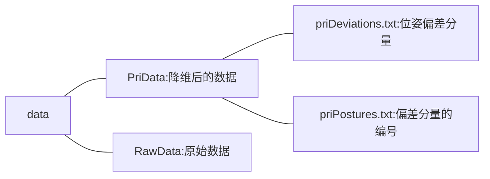
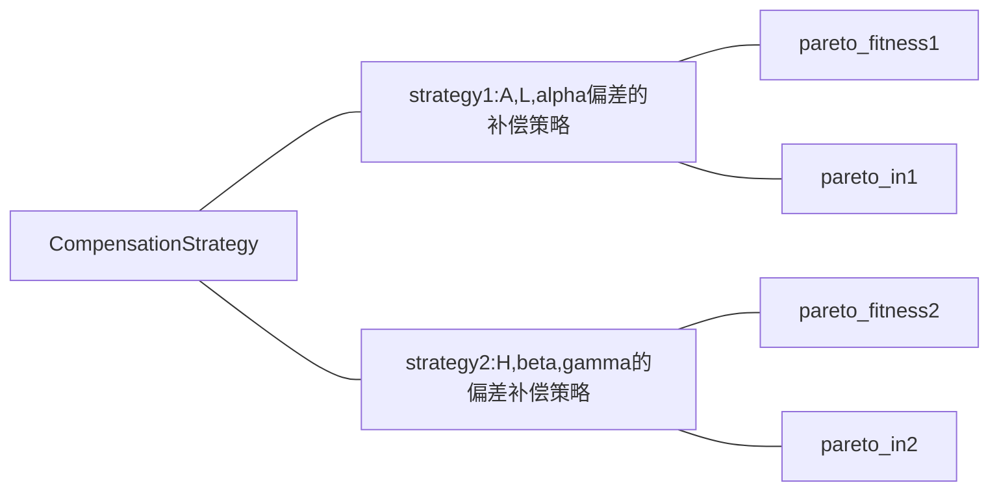

# 毕业设计
## 悬臂式掘进机实时姿态智能最优控制方法  
### Part 1位姿补偿
首先根据悬臂式掘进机的拓扑结构模型，推导出各个空间姿态参数与各个结构回路之间的关系式 
悬臂式掘进机共有6个位姿参数：
$$
W=A,L,H,\alpha,\beta,\gamma
$$
***psoition.py***	记录了位姿参数与各个结构回路变化量之间的关系；

***pca.py***	利用主成分分析法（PCA）对位姿偏差数据进行降维，得到对位姿偏差影响最大的几个偏差分量，记录下这些偏差分量以及他们的编号

***communaldata.py***	作为公共数据文件，在各个程序之间共享数据；

***optimization.py***	记录各个位姿参数的目标函数；

***pso.py***	利用粒子群算法（PSO）进行寻优；

***mpso.py***	利用多目标粒子群算法（MPSO）进行寻优，将结果保存在CompensationStrategy文件夹中；

***selectbest.py***	从Pareto解集中选择最优的补偿策略，将结果保存在result文件夹中

### Part 2电液伺服系统的控制

基于simulink建立了电液伺服系统的模，利用Bode图分析了其特性；

首先利用PID对其进行控制；

之后在MATLAB 中建立模糊控制模型，选择合适的隶属度函数、模糊论域等，再将其导入到simulink中

应用模糊PID对电液伺服系统进行控制，然后分别分析这两种控制方式的动态特性，并进行比较。

parameter.m	记录运行电液伺服系统模型时需要的参数

bode.m	绘制Bode图

FuzzyPID.m	对两种控制方式的效果进行分析

fuzzy_PID.fis	存储在MATLAB中生成的模糊控制模型，以便后续导入到simulink中

Fuzzy_pid.slx	电液伺服系统的模型
